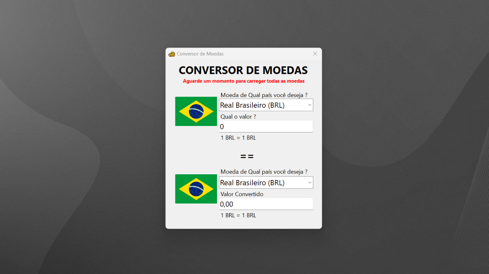
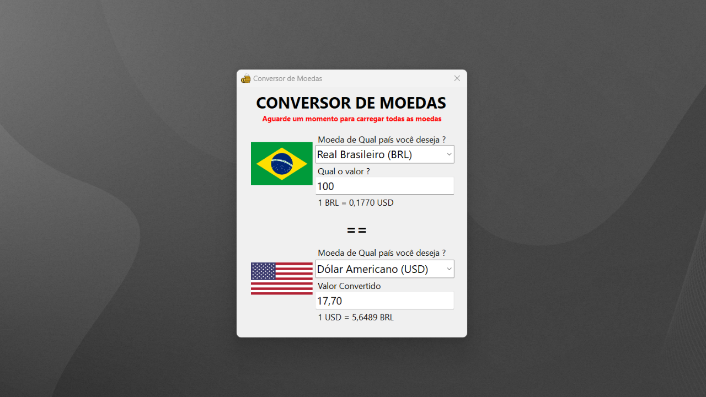

# 💱 Conversor de Moedas com C# (.NET WinForms)

Este projeto consiste em um **Conversor de Moedas multilíngue** com interface gráfica intuitiva desenvolvida em **C# com WinForms**, integrando **APIs públicas** para fornecer **conversões de moedas em tempo real**.

---

## 🔧 Funcionalidades

✅ **Conversão automática bidirecional** entre moedas.  
✅ **Atualização em tempo real** das taxas de câmbio via [Frankfurter API](https://www.frankfurter.app/).  
✅ **Carregamento dinâmico** de bandeiras nacionais via [RestCountries API](https://restcountries.com/).  
✅ Suporte a dezenas de moedas, com nomes traduzidos para o **português** e ícones representativos.  
✅ **Tratamento completo de exceções** e falhas de rede.  
✅ **Interface limpa e responsiva**, com auto-complete nos ComboBoxes.

---

## 🛠️ Tecnologias Utilizadas

- ✅ C# (.NET Framework)  
- ✅ WinForms  
- ✅ APIs HTTP com `HttpClient`  
- ✅ Desserialização JSON com `System.Text.Json`  
- ✅ Manipulação de imagens (`PictureBox`)  
- ✅ Arquitetura baseada em DTOs

---

## 📈 Destaques Técnicos

✨ Atualização **inteligente** dos campos de texto sem disparar eventos duplicados.  
✨ **Conversão reversa** automática com taxa unitária quando o valor inserido é zero.  
✨ Uso de **boas práticas de programação assíncrona** com `async/await`.  
✨ **Desacoplamento lógico** entre UI, conversão e integração com APIs.

---

## 🎯 Como usar

1. Execute o projeto.
2. Aguarde o carregamento automático das moedas e bandeiras.
3. Selecione a moeda de origem e destino.
4. Insira o valor desejado.
5. Confira a conversão automática exibida!

---

## 📎 Exemplo de Tela

### ✅ Conversão BRL → USD

---

## 🔗 Link do Projeto

➡️ [GitHub do Projeto](https://github.com/SeuUsuario/ConversorMoeda)

---

## 📝 Licença

Distribuído sob a licença MIT.
